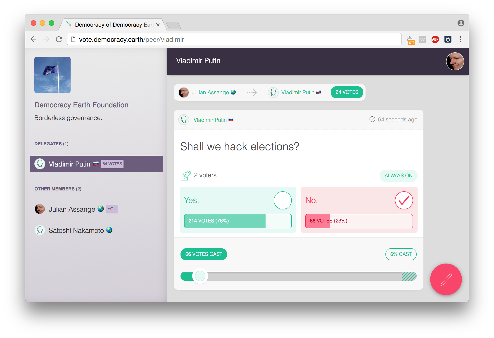

<p align="center">

</p>

# Sovereign

A token based liquid democracy software.

[](https://gitter.im/DemocracyEarth/sovereign?utm_source=badge&utm_medium=badge&utm_campaign=pr-badge&utm_content=badge)
[](http://chat.democracy.earth)
[](https://bestpractices.coreinfrastructure.org/projects/599)
[](https://codeclimate.com/github/DemocracyEarth/sovereign)

Read our 📃 [open source white paper](https://github.com/DemocracyEarth/paper).

See our 🇫🇷 [Paris 2016 conference](https://youtube.com/watch?v=UajbQTHnTfM) presentation.

<p align="center">

</p>

**Features:**

  - [X] Liquid democracy toolkit:
    * Voting & delegation of votes.
    * Ballots with multiple options.
    * Bottom-up system of proposals.
  - [X] Transaction engine based on voting tokens (_currently blockchain agnostic_).
  - [X] Mobile & desktop responsive UX.

**Roadmap:**

  - [X] Decentralized identity key management 🔗 with [Blockstack](https://github.com/blockstack/blockstack).
  - [ ] Satoshi-based governance 🔗 with [Lightning](https://github.com/lightningnetwork/lnd).
  - [ ] Institutional incorporation via smart contracts 🔗 with [Open Zeppelin](https://github.com/OpenZeppelin/zeppelin-solidity).
  - [ ] Bitcoin integration for budgeting 🔗 with [Bcoin](https://github.com/bcoin-org/bcoin).
  - [ ] Distributed resource storage 🔗 with [IPFS](https://github.com/ipfs/js-ipfs).
  - [ ] Native desktop client 🔗 with [Electron](https://github.com/electron/electron).

**Release:**

[`version 1.0.4-alpha`](https://github.com/DemocracyEarth/sovereign/releases/tag/1.0.4-alpha)

**Also:**

Inspired by the 📃 [Universal Declaration of Human Rights](https://en.wikipedia.org/wiki/Universal_Declaration_of_Human_Rights).

>   _Everyone has the right to freedom of opinion and expression; this right includes freedom to hold opinions without interference and to seek, receive and impart information and ideas through any media and regardless of frontiers. Everyone has the right to freedom of peaceful assembly and association. Everyone has the right to take part in the government of his country, directly or through freely chosen representatives._


Built for [personal sovereignty](https://www.amazon.com/Sovereign-Individual-Mastering-Transition-Information/dp/0684832720) ✊.

## Setup

0. **Install Framework**

    On Linux & MacOS, load a terminal and type:

    ```sh
    $ curl https://install.meteor.com/ | sh
    ```

    This will setup [Meteor](https://github.com/meteor/meteor) (including [Node](https://github.com/nodejs/node) and [Mongo](https://github.com/mongodb/mongo) if necessary).

    > _Note:_ Windows users must [download installer](https://www.meteor.com/install).

0. **Clone Repository**

    ```sh
    $ git clone https://github.com/DemocracyEarth/sovereign.git
    $ cd sovereign
    ```

0. **Install Dependencies**

    if you have npm installed, type:

    ```sh
    $ npm install
    ```

    if you only have meteor, type:

    ```sh
    $ meteor npm install
    ```

0. **Run App**

    While in repository directory type:

    ```sh
    $ meteor npm run start:dev
    ```

    Load browser and go to [http://localhost:3000/](http://localhost:3000/) 🔥

    > _Note:_ For production deploys you should use:  
    > ``` $ meteor npm run start ```
    > check production/settings.json file to config your keys.

0. **Start a Revolution**

    Persuade members of any organization you belong to try sovereign governance. [Tell us about it](mailto:hello@democracy.earth) so we can learn from the experience and improve our work.

    > _Note:_ To begin a movement check our paper _[How to start a Net Party](https://www.slideshare.net/santisiri/how-to-make-a-net-party)_.

    🕊

## Live

* 🌎 Democracy Earth Foundation: [vote.democracy.earth](https://vote.democracy.earth).

### Reports

* 🇨🇴 Report on [2016 Colombia Referendum](https://medium.com/@DemocracyEarth/a-digital-referendum-for-colombias-diaspora-aeef071ec014#.xbyqt3blq).
* 🗺 OECD Report on [Blockchain Voting for Peace](https://www.oecd.org/gov/innovative-government/embracing-innovation-in-government-colombia.pdf).

## Specifications

* Built on [Meteor](https://www.meteor.com/) version 1.5.0
* Designed with [Webflow](https://www.webflow.com).

Check our [documentation](https://github.com/DemocracyEarth/sovereign/tree/master/docs) for technical reference.

**Supported Browsers:**

| [](https://godban.github.io/browsers-support-badges/)</br>IE / Edge | [](https://godban.github.io/browsers-support-badges/)</br>Firefox | [](http://godban.github.io/browsers-support-badges/)</br>Chrome | [](http://godban.github.io/browsers-support-badges/)</br>Safari | [](http://godban.github.io/browsers-support-badges/)</br>iOS Safari | [](http://godban.github.io/browsers-support-badges/)</br>Chrome for Android |
| --------- | --------- | --------- | --------- | --------- | --------- |
| IE10, IE11, Edge| last 2 versions| last 4 versions| last 4 versions| last 4 versions| last 4 versions


## Contribute

Sovereign is a **free & open source project**.

Check our [contributors list](https://github.com/DemocracyEarth/sovereign/graphs/contributors).

If you want to collaborate with pull requests (features, fixes, issues, projects), please follow our [contributing guidelines](CONTRIBUTING.md).

Available tasks in the [to do list](TODO.md) to join.

Also you can find our projects and tasks in the [project area](https://github.com/DemocracyEarth/sovereign/projects).

### Backers:

Join our [Open Collective](https://opencollective.com/democracyearth):

<a href="https://opencollective.com/democracyearth/backer/0/website"></a>
<a href="https://opencollective.com/democracyearth/backer/1/website"></a>
<a href="https://opencollective.com/democracyearth/backer/2/website"></a>
<a href="https://opencollective.com/democracyearth/backer/3/website"></a>
<a href="https://opencollective.com/democracyearth/backer/4/website"></a>
<a href="https://opencollective.com/democracyearth/backer/5/website"></a>
<a href="https://opencollective.com/democracyearth/backer/6/website"></a>
<a href="https://opencollective.com/democracyearth/backer/7/website"></a>
<a href="https://opencollective.com/democracyearth/backer/8/website"></a>
<a href="https://opencollective.com/democracyearth/backer/9/website"></a>
<a href="https://opencollective.com/democracyearth/backer/10/website"></a>

Support our work with [Bitcoin](https://github.com/bitcoin) & other cryptocurrencies:

<p align="left">

</p>

* BTC Address: `1BtQMS7snrisEFMB1fMecXPyeHwwcWnpGE`
* ETH Address: `0xE3670E862850D58E0af745d06021c1c0555235dF`

## About

Democracy Earth Foundation is a _501 (c) 3 not for profit corporation_ in San Francisco, California 🌎 with no political affiliations of any kind. Our partners include:

<p align="left">
<a href="https://ycombinator.com"></a>
<a href="https://ffwd.org"></a>
</p>

Also check our [donors list](DONORS.md).

## License

This software is under an [MIT License](LICENSE.md).
Some rights reserved, 2015 - 2018 [Democracy Earth Foundation](https://democracy.earth).
