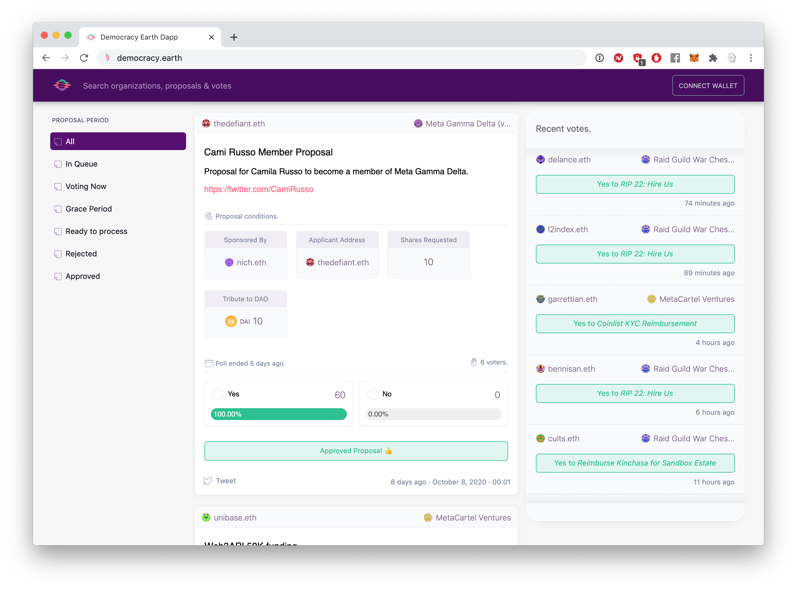

<p align="center">


Explore and participate in Digital Autonomous Organizations (DAOs).

[](https://discord.com/invite/HGsyGXw)


</p>

## Features

  - [X] Built for Ethereum using [Web3](https://github.com/ethereum/web3.js/).
  - [X] Implements [Graph Protocol](https://github.com/graphprotocol) to read blockchain.
  - [X] Explore [MolochDAO](https://github.com/MolochVentures/moloch) compatible contracts.
  - [X] Deployable on [IPFS](http://github.com/ipfs).
  - [X] Supports [ERC20](https://github.com/ethereum/eips/issues/20) and [ERC721](https://github.com/ethereum/eips/issues/721) tokens.    
  - [X] Mobile & desktop responsive UX.
  
**Release:**

* Currently [`version 0.9`](https://github.com/DemocracyEarth/dapp/releases)
* This [User Agreement](https://github.com/DemocracyEarth/dapp/blob/master/AGREEMENT.md) governs access to and use of the Democracy Earth platform.

## Setup

1. Clone Repository

    ```sh
    $ git clone https://github.com/DemocracyEarth/dapp.git
    $ cd dapp
    ```

2. Install Dependencies

    ```sh
    $ npm install
    ```

3. Run Dapp

    ```sh
    $ npm run start
    ```

    Browser will launch on [http://localhost:3000/](http://localhost:3000/).


## Live

* Democracy Earth: [democracy.earth](https://democracy.earth).

### Conferences

* 🇧🇷 Democracy in the Age of Cryptography [RadicalxChange 2020](https://www.youtube.com/watch?v=9d8zmkmfb68).
* 🇯🇵 Machine Learning resistance for Human Rights [DevconV Osaka 2019](https://www.youtube.com/watch?v=tZ_76AZtOf8).
* 🇩🇪 DAO panel on Web3 Summit [Berlin 2019](https://www.youtube.com/watch?v=JJBDcG2EqwE).
* 🇺🇸 How blockchains can help create democracies everywhere [New York 2019](https://www.youtube.com/watch?v=o2u0g0-hjgk).
* 🇨🇷 La Era Post Estado-Nacion [Costa Rica 2017](https://www.youtube.com/watch?v=BlYZpNVtNvU).
* 🇬🇬 The future of democracy in [Guernsey 2016](https://www.youtube.com/watch?v=yGmGWZCE4h0).
* 🇫🇷 On digital democracy in [Paris 2016](https://youtube.com/watch?v=UajbQTHnTfM).

### Use Cases

* 📃 Read our [White Paper](https://github.com/DemocracyEarth/paper).
* 🇺🇸 Quadratic Voting for the [2019-2020 Legislative Season of the State of Colorado](https://www.bloomberg.com/news/articles/2019-05-01/a-new-way-of-voting-that-makes-zealotry-expensive).
* 🇭🇰 Umbrella Movement Shadow Referendum [2017 Hong Kong](https://www.slideshare.net/mysociety/the-impacts-of-popvote-in-hong-kong-virgile-deville-democracy-earth).
* 🇺🇳 Blockchain Voting for Peace [OECD Report 2017](https://www.oecd.org/gov/innovative-government/embracing-innovation-in-government-colombia.pdf).
* 🇨🇴 Report on [2016 Colombia Referendum](https://medium.com/@DemocracyEarth/a-digital-referendum-for-colombias-diaspora-aeef071ec014#.xbyqt3blq).

## Contribute

This dapp is a free, open source and censorship resistant.

### Backers

Join our [Open Collective](https://opencollective.com/democracyearth):

<a href="https://opencollective.com/democracyearth/backer/0/website"></a>
<a href="https://opencollective.com/democracyearth/backer/1/website"></a>
<a href="https://opencollective.com/democracyearth/backer/2/website"></a>
<a href="https://opencollective.com/democracyearth/backer/3/website"></a>
<a href="https://opencollective.com/democracyearth/backer/4/website"></a>
<a href="https://opencollective.com/democracyearth/backer/5/website"></a>
<a href="https://opencollective.com/democracyearth/backer/6/website"></a>
<a href="https://opencollective.com/democracyearth/backer/7/website"></a>
<a href="https://opencollective.com/democracyearth/backer/8/website"></a>
<a href="https://opencollective.com/democracyearth/backer/9/website"></a>
<a href="https://opencollective.com/democracyearth/backer/10/website"></a>
<a href="https://opencollective.com/democracyearth/backer/11/website"></a>

### About

Democracy Earth Foundation is a _501 (c) 3 not for profit corporation_ in San Francisco, California with no political affiliations. Our institutional backers include:

<p align="center">
<a href="https://ycombinator.com"></a>
<a href="https://ffwd.org"></a>
<a href="https://www.templetonworldcharity.org/"></a>
</p>

Also check our [donors list](DONORS.md).

## License

This software is under an [MIT License](LICENSE.md).
This is a free software built by [Democracy Earth Foundation](https://democracy.earth) between 2015 and 2020.
