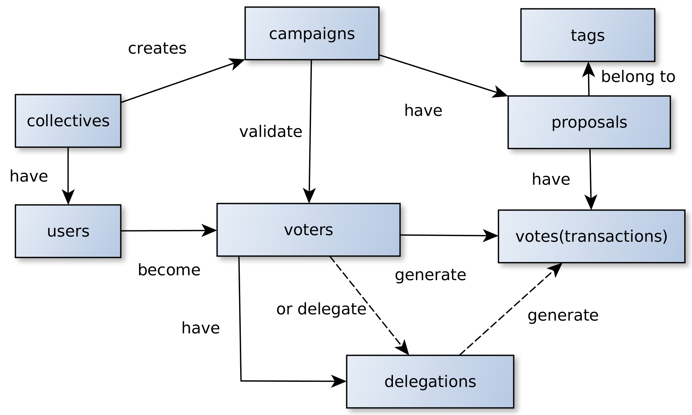

# Database Collections


# Tests
## Seed Database
Go to [seed-db](seed-db/readme.md) and follow the guide to setup our demo database

## Run
### Web Reporter
For Unit test, in main repository run:

```sh
$ meteor npm run test-watch
```

For integration test/full-app test, in main repository run:
```sh
$ meteor npm run test-app-watch
```

Load browser and go to [http://localhost:3001/](http://localhost:3001/) ☕️

### Console Reporter
For Unit test, in main repository run:

```sh
$ meteor npm run test
```
> This test is run by CircleCI to validate changes against github repository

For integration test/full-app test, in main repository run:
```sh
$ meteor npm run test-app
```


## Write
To write your own test:

* use `*.test[s].*`, or `*.spec[s].*` for **unit tests** and **simple integration tests**.
* use `*.app-test[s].*` and `*.app-spec[s].*` for **app integration tests**  and **acceptance tests**.

Follow the meteor guide to get more examples and details [https://guide.meteor.com/testing.html](https://guide.meteor.com/testing.html)

# Development

We follow [Meteor style guidelines](https://guide.meteor.com/code-style.html)

Our Meteor code style notes:
* Check [airbnb style guide](https://github.com/airbnb/javascript)
* [install ESlint](https://guide.meteor.com/code-style.html#eslint-installing)
* integrate ESlint it in your [editor](https://guide.meteor.com/code-style.html#eslint-editor)
* Check your code with ESLint
